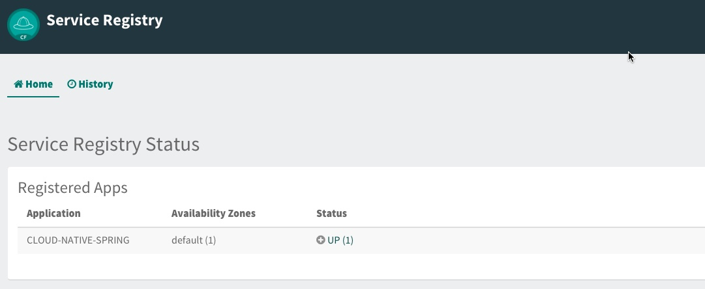

ifdef::env-github[]
:tip-caption: :bulb:
:note-caption: :information_source:
:important-caption: :heavy_exclamation_mark:
:caution-caption: :fire:
:warning-caption: :warning:
endif::[]
:spring-boot-version: 1.5.10
:spring-cloud-services-dependencies-version: 1.6.0.RELEASE
:spring-cloud-dependencies-version: Edgware.RELEASE

= Adding Spring Cloud Service Registration and Discovery

== Overview

[.lead]
In this lab we'll utilize Spring Boot and Spring Cloud to allow our application to register itself with a service registry.  To do this we'll also need to provision an instance of a Service Registry using Pivotal Cloud Foundry Spring Cloud Services, which is based on https://github.com/Netflix/eureka[Eureka], Netflix’s Service Discovery server and client.  We'll also add a simple client application that looks up our application from the Service Registry and makes requests to our `Cities` service see [https://github.com/cdevpivotal/cn-workshop/blob/master/labs/lab02/lab02.adoc]

== Update _Cloud-Native-Spring_ Boot Application to Register with Service Registry

. These features are added by adding `spring-cloud-services-starter-service-registry` to the classpath. Add the following spring cloud services to your Maven project dependencies:
+
.cloud-native-spring/pom.xml
[source,xml]
----
<dependency>
  <groupId>io.pivotal.spring.cloud</groupId>
  <artifactId>spring-cloud-services-starter-service-registry</artifactId>
</dependency>
----

. Thanks to Spring Cloud, instructing your application to register with Service Registry is as simple as adding a single annotation to your app! Add an @EnableDiscoveryClient annotation to the `io.pivotal.cloudnativespring.CloudNativeSpringApplication` class:
+
.cloud-native-spring/src/main/java/io/pivotal/cloudnativespring/CloudNativeSpringApplication.java
[source,java,numbered]
----
@SpringBootApplication
@RestController
@EnableJpaRepositories
@EnableDiscoveryClient // <---- Add this
@Import(RepositoryRestMvcAutoConfiguration.class)
public class CloudNativeSpringApplication {
    [...]
}
----
+
Completed:
+
[source,java,numbered]
----
package io.pivotal.cloudnativespring;

import org.springframework.beans.factory.annotation.Value;
import org.springframework.boot.SpringApplication;
import org.springframework.boot.autoconfigure.SpringBootApplication;
import org.springframework.cloud.client.discovery.EnableDiscoveryClient;
import org.springframework.context.annotation.Import;
import org.springframework.data.jpa.repository.config.EnableJpaRepositories;
import org.springframework.data.rest.webmvc.config.RepositoryRestMvcConfiguration;
import org.springframework.web.bind.annotation.RequestMapping;
import org.springframework.web.bind.annotation.RestController;

@SpringBootApplication
@RestController
@EnableJpaRepositories
@EnableDiscoveryClient
@Import(RepositoryRestMvcConfiguration.class)
public class CloudNativeSpringApplication {

    @Value("${greeting:Hola}")
    private String greeting;

    public static void main(String[] args) {
        SpringApplication.run(CloudNativeSpringApplication.class, args);
    }

    @RequestMapping("/")
    public String hello() {
        return greeting + " World!";
    }
}
----

== Create Spring Cloud Service Registry instance and deploy application

. Now that our application is ready to read registry with a Service Registry instance, we need to deploy one!  This can be done through Cloud Foundry using the services marketplace.  Previously we did this through the Marketplace UI, but this time we will use the Cloud Foundry CLI (though we could also do this through the UI):
+
[source,bash]
----
sc-workshop/labs/my_work/cloud-native-spring $ cf create-service p-service-registry standard service-registry
----

. After you create the service registry instance navigate to your Cloud Foundry _space_ in the Apps Manager UI and refresh the page.  You should now see the newly create `service-registry` instance.  Select the manage link to view the registry dashboard.  Note that there are not any registered applications at the moment:
+
image::images/registry1.jpg[]

. We will now bind our application to our service-registry within our Cloud Foundry deployment manifest.  Add the additional reference the services list in our Cloud Foundry manifest:
+
.cloud-native-spring/manifest.yml
[source,yml]
----
  services:
  - config-server
  - service-registry # <-- Add this
----
+
Complete:
+
[source,yml]
----
---
applications:
- name: cloud-native-spring
  random-route: true
  memory: 768M
  path: target/cloud-native-spring-0.0.1-SNAPSHOT-exec.jar
  timeout: 180
  env:
    JAVA_OPTS: -Djava.security.egd=file:///dev/urandom
  services:
  - config-server
  - service-registry
----

== Deploy and test application

. For the 2nd half of this lab we'll need our `cloud-native-spring` Maven artifact accessible in our local Maven repository. Rebuild and install the artifact with the following command:
+
[source,bash]
----
sc-workshop/labs/my_work/cloud-native-spring $ ./mvnw install
----

. Push application into Cloud Foundry
+
[source,bash]
----
sc-workshop/labs/my_work/cloud-native-spring $ cf push
----

. If we now test our application URLs we will no change.  However, if we view the Service Registry dashboard (accessible from the *Manage* link in Apps Manager) you will see that a service named `CLOUD-NATIVE-SPRING` has registered:
+

